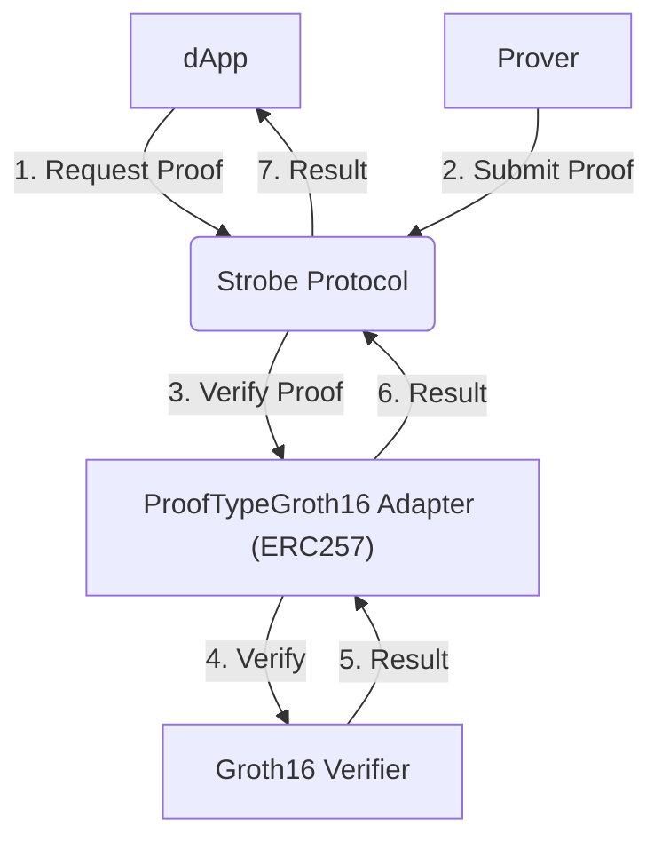

## What is Strobe Protocol?

Strobe Protocol is a comprehensive framework for managing zero-knowledge proofs (ZKPs) on blockchain networks. It provides a set of smart contracts and tools that enable developers to easily integrate ZKP functionality into their decentralized applications (dApps).

## Core Primitives

Strobe Protocol is built around three fundamental operations:

<CardGroup cols={3}>
  <Card
    title="Requesting Proofs"
    icon="file-circle-plus"
    href="/core-concepts/requesting-proofs"
  >
    Initiate a request for a specific zero-knowledge proof
  </Card>
  <Card
    title="Fulfilling Proof Requests"
    icon="clipboard-check"
    href="/core-concepts/fulfilling-requests"
  >
    Generate and submit proofs in response to requests
  </Card>
  <Card
    title="Submitting Proofs"
    icon="paper-plane"
    href="/core-concepts/submitting-proofs"
  >
    Directly submit and verify proofs without a prior request
  </Card>
</CardGroup>

## How It Works

Strobe Protocol leverages several key components to provide a flexible and powerful framework for zero-knowledge proof integration:

**ERC257: Standardized Verifier Interface**

At the core of Strobe Protocol is ERC257, a standard interface for zero-knowledge proof verifiers. This standard allows for seamless integration of various types of verifiers, ensuring interoperability across different ZKP systems. Developers can create custom adapters for different types of zero-knowledge proof systems, allowing dApps to work with a wide range of ZKP technologies.

## Key Features

- **Decentralized:** Runs entirely on-chain, leveraging the security and transparency of blockchain networks.
- **Flexible:** Supports various types of zero-knowledge proofs and verifiers.
- **Interoperable:** Can be easily integrated with existing smart contracts and dApps.
- **Efficient:** Optimized for gas usage and performance.
- **Extensible:** Allows for the creation of custom verifier adapters to support new ZKP systems.

## Use Cases

dApps can integrate Strobe Protocol and its verifiers in various ways, depending on their specific use cases:

1. **Prediction Markets:** Utilize ZK-email proofs to resolve outcomes in decentralized prediction markets.
2. **ZK-ERC20 Tokens:** Create tokens that can only be minted by providing a valid zero-knowledge proof.
3. **Identity Verification:** Implement privacy-preserving identity checks using ZKPs.
4. **Confidential Transactions:** Enable private transactions with selective disclosure using ZKPs.

## Next Steps

<CardGroup cols={2}>
  <Card
    title="Core Concepts"
    icon="book"
    href="/core-concepts/overview"
  >
    Dive deeper into Strobe Protocol's fundamental concepts
  </Card>
  <Card
    title="API Reference"
    icon="code"
    href="/api/strobe-core"
  >
    Explore the StrobeCore contract interface
  </Card>
  <Card
    title="Tutorials"
    icon="graduation-cap"
    href="/tutorials/first-app"
  >
    Build your first application with Strobe Protocol
  </Card>
  <Card
    title="Advanced Topics"
    icon="layer-group"
    href="/advanced/custom-verifiers"
  >
    Learn about custom verifiers and advanced use cases
  </Card>
</CardGroup>